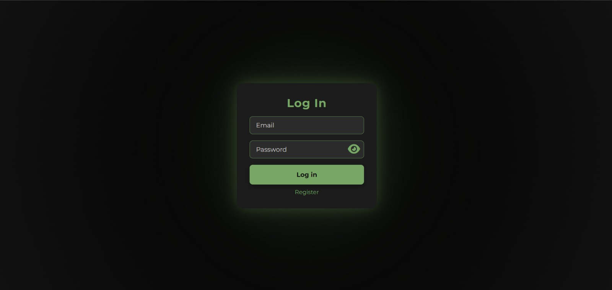
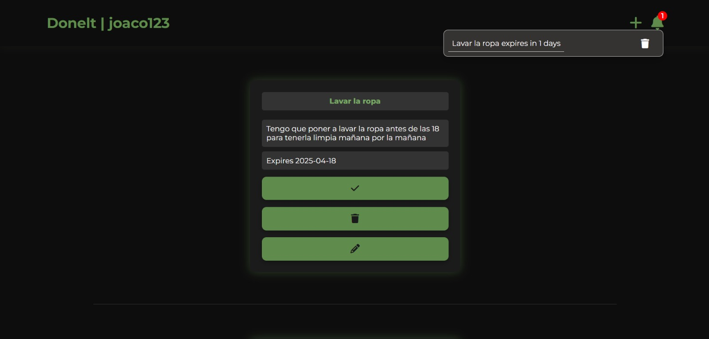
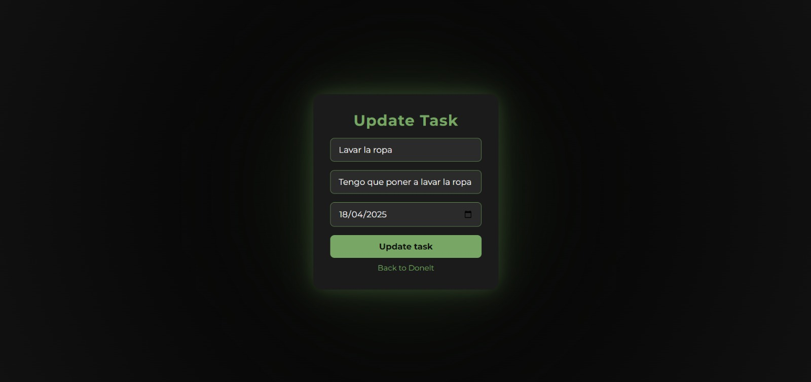

# 📋 Donelt – Sistema de Gestión de Tareas

**Donelt** es una software desarrollado con arquitectura de microservicios que permite a los usuarios gestionar sus tareas de manera eficiente. Con esta plataforma podrás crear, editar, eliminar y completar tareas, además de recibir notificaciones automáticas cuando se aproximen las fechas de vencimiento.

---
## 🖼️ Imagenes del proyecto

## ⚙️ Tecnologías Utilizadas

### 🧠 Backend
- Java 21
- Spring Boot
- Spring Cloud (Eureka, Feign Client)
- Spring Data JPA + Hibernate
- MySQL
- Resilience4j (Circuit Breaker)
- Spring Scheduler

### 🎨 Frontend
- HTML5
- CSS3
- JavaScript (Vanilla)

### 🔧 Infraestructura
- Eureka Server (Service Discovery)
- API Gateway (enrutamiento)
- Microservicios separados por responsabilidad
  
### ✅ Funcionalidades
- Registro y login de usuarios

- Crear, editar y eliminar tareas

- Marcar tareas como completadas

- Notificaciones automáticas (programadas)

- Sistema tolerante a fallos con Circuit Breaker

- Interfaz clara, intuitiva y funcional
---
## 📅 Notificaciones Automáticas
El sistema utiliza @Scheduled para verificar diariamente (a las 9:00, 10:00 y 11:00) si existen tareas que vencen en 3 días o menos, y genera una notificación si aún no fue enviada ese día.

Esto está implementado con:

- @Scheduled

- @CircuitBreaker (para manejar fallos del microservicio de notificaciones)

- Campo lastNotified en la entidad Task para evitar duplicados.

## 🚀 Cómo Ejecutar el Proyecto
### Clonar el repositorio:

git clone https://github.com/JoaquinRouge/Microservices-Donelt.git

### Configurar MySQL:

- Crear una base de datos llamada donelt

- Actualizar las credenciales de conexión en los application.properties de cada microservicio.

### Iniciar los servicios en orden:

- eureka-server

- gateway-service

- task-service

- notification-service

- frontend (Live Server)
  
## 📌 Mejoras Futuras
- Implementar sistema de prioridad para tareas

- Agregar filtro por estado y fecha

- Dashboard de productividad del usuario

- Envío de notificaciones por email

- Agregar JWT para autenticación segura

## 👨‍💻 Autor
Joaquín Rougé Núñez
